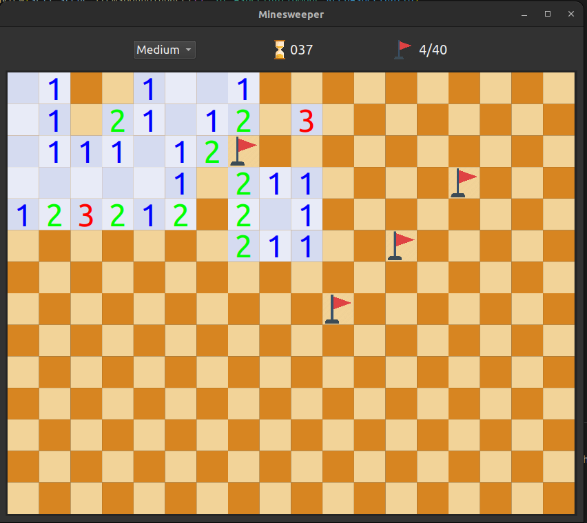
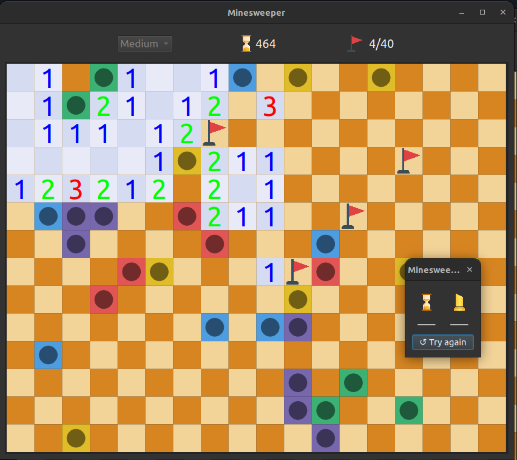

# Minesweeper
An implementation of minesweeper on PyQt6 complete with timer, score saving functionality and a difficulty selector with three options (easy, medium or hard). The board is based of the Lichess colorscheme, and the UI format is based of Google's minesweeper. To start the application, run the command
```
python3 main.py
```
from the cloned directory. Images of the completed application are shown below: 


Upon exploding a mine, all other mines will begin to explode in random order, and tiles that are not bombs but incorrectly marked with a flag will be replaced by an X. Image of a lost game shown below: 



